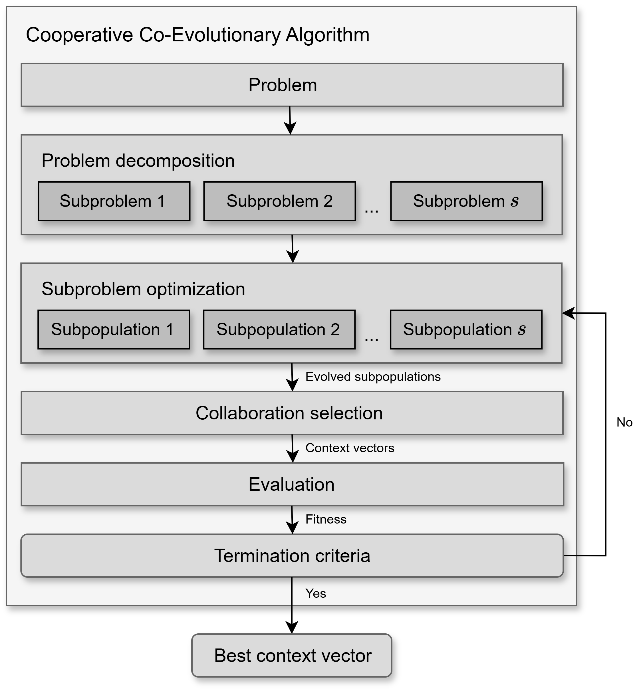

User Guide
==========

This user guide provides a comprehensive overview of how to use **PyCCEA**, a Python package for
feature selection based on **Cooperative Co-Evolutionary Algorithms (CCEAs)**. It covers both the
theoretical foundations and practical aspects of the framework, including configuration files,
algorithm components, benchmark and result reproducibility.

Whether you're a researcher aiming to benchmark feature selection algorithms or a practitioner
optimizing high-dimensional datasets, this guide will walk you through the key concepts, options,
and implementation details necessary to use PyCCEA effectively.

Feature selection problem
-------------------------

Given an input matrix :math:`\mathbf{X} \in \mathbb{R}^{m \times n}`, representing a dataset with
:math:`m` instances and :math:`n` features, and an output vector
:math:`\mathbf{y} \in \mathbb{B}^{m \times 1}` containing target labels for each instance, the
feature selection problem can be formulated as a **combinatorial optimization task**.

The goal is to identify a subset of features :math:`S^* \subseteq \mathcal{F}` that maximizes a
predefined objective function :math:`f`, where :math:`\mathcal{F} = \{f_1, f_2, \dots, f_n\}`
denotes the full feature set.

The objective function :math:`f` evaluates the quality or relevance of selected features,
typically by measuring the performance of a learning model trained and tested on the selected
feature subset. The function :math:`f` may consider factors such as predictive accuracy,
model complexity, interpretability, computational efficiency, or domain-specific criteria.
Additional constraints or regularization terms may also be included to control aspects like the
number of selected features or redundancy among them.

An arbitrary solution :math:`S` corresponds to a subset of selected feature indices, such that
:math:`\|S\| = n_s \leq n`. For instance, if :math:`S = \{i, j, k\}`, it implies that the
:math:`i`-th, :math:`j`-th, and :math:`k`-th features are selected from the original feature set,
resulting in a data subset :math:`\mathbf{X}[:, S] = \mathbf{X}^{'} \in \mathbb{R}^{m \times n_s}`.

Formally, the feature selection problem is defined as:

.. math::

    S^{*} = \operatorname*{arg\,max}_{S \subseteq \{f_1, f_2, \dots, f_n\}} f(\mathbf{X}^{'}, \mathbf{y})

where :math:`f(\mathbf{X}^{'}, \mathbf{y})` represents the fitness value of the selected feature
subset :math:`\mathbf{X}^{'} = \mathbf{X}[:, S]`.

Cooperative co-evolutionary algorithms
--------------------------------------

Cooperative co-evolutionary algorithms (CCEAs) are a class of evolutionary computation techniques
designed to tackle complex, large-scale optimization problems by decomposing them into smaller,
more manageable subproblems. Each subproblem is addressed by an independent subpopulation, which
is evolved by its own dedicated evolutionary algorithm. After an optimization cycle, the
evaluation of each individual is determined based on their effectiveness in collaborating with
representative individuals from other subpopulations to collectively compose one or more complete
solutions (context vectors). This iterative process continues until convergence or a termination
condition is met, as shown in :numref:`CCEA_framework_figure`.

.. _CCEA_framework_figure:


   A general framework of a Cooperative Co-Evolutionary Algorithm (CCEA).

Problem decomposition
^^^^^^^^^^^^^^^^^^^^^

In feature selection, problem decomposition, also referred to as feature grouping in the
literature, divides the original feature set :math:`\mathcal{F}` into :math:`s` subcomponents
(:math:`\mathbf{f}_1, \mathbf{f}_2, \mathbf{f}_3, \ldots, \mathbf{f}_{s}`), where :math:`s` is
considerably smaller than the total number of features :math:`n`. Each subcomponent
:math:`\mathbf{f}_i` contains :math:`n_{f_i}` features and is associated with a subpopulation
:math:`\mathbf{P}_i` for evolution. The size of :math:`\mathbf{P}_i` is :math:`s_{p_i}`
individuals and represents the allocated computational resources or desired diversity for
exploring the :math:`i`-th subcomponent.

- **Sequential**: This strategy consists of splitting the feature set :math:`\mathcal{F}` into
  :math:`s` disjoint subcomponents of equal size :math:`n_f`, where
  :math:`\sum_{i=1}^{s} n_{f_i} = n` and :math:`n_{f_i} = n_f \ \forall i \in \{1, 2, \ldots, s\}`.
  The assignment of features to subcomponents is performed in the same order as they are originally
  arranged, starting from feature 1 to feature :math:`n`. This naive strategy offers computational
  efficiency but tends to overlook important feature interactions. For detailed information on
  configuring and using this strategy, refer to the 
  :py:class:`pyccea.decomposition.SequentialFeatureGrouping` class.
- **Random**: This widely used decomposition strategy addresses the drawback of sequential
  grouping by randomly splitting the feature set :math:`\mathcal{F}` into :math:`s` disjoint
  subcomponents of equal size :math:`n_f`. This approach allows features that interact with each
  other to be placed in the same subcomponent purely by chance, which can improve the overall
  performance of the decomposition. For detailed information on configuring and using this 
  strategy, refer to the :py:class:`pyccea.decomposition.RandomFeatureGrouping` class.
- **Ranking-based**: This strategy builds subcomponents according to the importance, correlation,
  or relevance of features to a particular task. It typically assigns scores to all features using
  a predefined metric and then divides the feature set :math:`\mathcal{F}` into :math:`s` disjoint
  subcomponents of equal size :math:`n_f` based on these scores. This allows for the strategic
  planning of feature allocation in alignment with the evolutionary process, such as uniformly
  distributing features from the highest-scoring to the lowest-scoring ones, or distributing
  high-importance features evenly among the subcomponents. For detailed information on configuring
  and using this strategy, refer to the :py:class:`pyccea.decomposition.RankingFeatureGrouping`
  class.

Subproblem optimization
^^^^^^^^^^^^^^^^^^^^^^^

Each subproblem, derived from the overall problem decomposition, is optimized by a dedicated
evolutionary algorithm. For each cooperative co-evolutionary cycle, the optimizer evolves its
respective subpopulation for a single generation. After this evolutionary step, the evolved
individuals are then passed to the collaboration and evaluation phases to assess their fitness in
the context of a complete solution. This iterative process aims to improve the "component" of the
overall solution that each subpopulation represents.

The following optimizers are available for evolving subpopulations:

- **Binary Genetic Algorithm (BGA)**:
  Since the solutions are always represented as binary vectors in the PyCCEA package, this
  optimizer is inherently suitable. It employs standard genetic operators, including 
  **single-point crossover** and **bit-flip mutation**. Individuals are selected for reproduction
  using **tournament selection**, and the survivor selection subpopulation update) can be either
  **generational** (replacing all individuals of the subpopulation) or **steady-state**
  (replacing only a few individuals), with the optional application of **elitism** to preserve
  top-performing individuals. For detailed information on its parameters and configuration, refer
  to the :py:class:`pyccea.optimizers.BinaryGeneticAlgorithm` class.

- **Differential Evolution (DE)**:
  Although DE is traditionally designed for continuous-valued optimization problems, PyCCEA adapts
  it to handle binary-valued problems through a conversion mechanism that maps continuous outputs
  to binary solutions. This is accomplished using either Homomorphous Mapping
  (:py:func:`~pyccea.utils.mapping.angle_modulation_function`) or a Shifted Heaviside Function
  (:py:func:`~pyccea.utils.mapping.shifted_heaviside_function`). These methods enable DE to
  operate effectively in a binary search space. For details on configuration and parameters,
  see :py:class:`pyccea.optimizers.DifferentialEvolution` class.

The `evolve` method within each optimizer is responsible for advancing a given subpopulation by a
single generation, taking the current subpopulation and their fitness values as input, and
returning the updated subpopulation for the next cycle.

Collaboration selection
^^^^^^^^^^^^^^^^^^^^^^^

To evaluate an individual from a subpopulation, it must be combined with representatives from the
other subpopulations to form one or more complete candidate solutions, known as
**context vectors**. The process of selecting individuals from the other subpopulations, excluding
the one containing the individual being evaluated, is referred to as **collaboration selection**.

Common collaboration strategies include:

- **Single random**: A single individual is randomly selected from each of the other
  subpopulations. For detailed information, refer to the
  :py:class:`pyccea.cooperation.SingleRandomCollaboration` class.
- **Single best**: The single best-performing individual (based on its last known fitness) is
  selected from each of the other subpopulations. For detailed information, refer to the
  :py:class:`pyccea.cooperation.SingleBestCollaboration` class.
- **Single elite**: A single individual is randomly chosen from a pre-defined elite set of
  top-performing individuals within each of the other subpopulations. For detailed information,
  refer to the :py:class:`pyccea.cooperation.SingleEliteCollaboration` class.

Fitness evaluation
^^^^^^^^^^^^^^^^^^

Fitness evaluation plays a central role in the feature selection process, as it determines how
well a candidate solution (i.e., a subset of features) performs. **PyCCEA uses a wrapper-based
evaluation strategy**, meaning that each feature subset is evaluated by training and testing a
machine learning model on it. This approach provides highly accurate and task-relevant feedback,
as it directly measures how well the selected features support the learning task.

In practice, the fitness of each individual (from a subpopulation) is computed by evaluating its
**context vector**, a full solution composed of that individual and collaborators from the other 
subpopulations, using the selected model and evaluation metric.

There are two fitness functions implemented, both supporting multi-objective evaluation by 
combining model performance with structural characteristics of the selected features. Each
function uses a weighted combination of :math:`m` objectives, such that
:math:`\sum_{i=1}^{m} w_i = 1`.

- **Penalty-based fitness**:
  This fitness function balances model predictive performance with the size of the selected
  feature subset. It penalizes large subsets to encourage more compact solutions.

  The final fitness is calculated as:

  .. math::

      f = w_1 \cdot \text{score} - w_2 \cdot \frac{|S|}{|\mathcal{F}|},

  where :math:`\text{score}` is a model evaluation metric (e.g., :math:`F_1`-score, balanced
  accuracy), and :math:`|S|` is the number of selected features.  
  See :py:class:`pyccea.fitness.SubsetSizePenalty` class for more details.

- **Distance-based fitness**:
  This fitness function combines predictive performance with structural properties of the feature
  space, using a **k-nearest neighbors (k-NN)** model. It optimizes three objectives:

    1. Maximizing predictive performance;
    2. Minimizing intra-class distance;
    3. Maximizing inter-class distance between instances.

  The fitness is calculated as:

  .. math::

      f = w_1 \cdot \text{score} +
          w_2 \cdot \frac{d_{\text{diff}}}{\sqrt{|S|}} +
          w_3 \cdot \left(1 - \frac{d_{\text{same}}}{\sqrt{|S|}}\right),

  where :math:`\text{score}` is a model evaluation metric (e.g., :math:`F_1`-score, balanced
  accuracy), :math:`|S|` is the number of selected features, :math:`d_{\text{same}}` is the
  average distance to neighbors with the same label, and :math:`d_{\text{diff}}` is the average
  distance to neighbors with different labels. See :py:class:`pyccea.fitness.DistanceBasedFitness`
  class for more details.

Termination criteria
^^^^^^^^^^^^^^^^^^^^

The feature selection process terminates when one of the following stopping conditions is met:

- A maximum of **10,000 generations** is reached.
- **Early stopping** is triggered after **100 consecutive generations** without improvement in
  the best solution (i.e., stagnation).

These criteria ensure that the optimization process does not run indefinitely and can stop early
if no progress is being made.

Both stopping parameters are defined in the `coevolution` section of the CCEA configuration
`.toml` file and can be customized by the user. Specifically:

- :code:`max_gen` controls the maximum number of generations.
- :code:`max_gen_without_improvement` sets the number of stagnant generations allowed before
  early stopping.

Users may adjust these values to suit different problem sizes or computational constraints.


Configuration files
-------------------

**PyCCEA** uses two main configuration files to manage its operations, each serving a distinct
purpose: one for data loading and preprocessing, and another for defining the parameters of the
Cooperative Co-Evolutionary Algorithm (CCEA). Both files are written in the **TOML format**, 
chosen for its straightforward, human-readable syntax that simplifies modification.

Data loader
^^^^^^^^^^^

This configuration file specifies the parameters that control how your dataset is loaded, split, and
preprocessed. An example is provided below:

.. code-block:: toml

    [general]
    splitter_type = "k_fold"
    verbose = true
    seed = 42

    [splitter]
    preset = false
    kfolds = 10
    stratified = true
    test_ratio = 0.2

    [normalization]
    normalize = true
    method = "min_max"

**Parameters:**

* **[general]**
    * ``splitter_type`` (string): Defines the strategy for splitting the dataset. Common options
      include `"k_fold"` and `"leave_one_out"`.
    * ``verbose`` (boolean): If ``true``, enables verbose output during data loading and splitting,
      providing detailed logs.
    * ``seed`` (integer, optional): Controls the randomness of the data split, ensuring
      reproducibility. If ``None``, a random seed will be used.

* **[splitter]**
    * ``preset`` (boolean): If ``true``, the data loader will use pre-defined training and testing
      subsets within your dataset (e.g., indicated by a 'subset' column). If ``false``, custom
      splitting parameters like ``kfolds`` or ``test_ratio`` will be applied.
    * ``kfolds`` (integer, optional): Applicable when ``splitter_type`` is `"k_fold"`. Specifies
      the number of folds for K-Fold cross-validation. This parameter is ignored for
      `"leave_one_out"`.
    * ``stratified`` (boolean): If ``true`` and the task is classification, this ensures that each
      fold maintains the same proportion of class labels as the original dataset. This is crucial
      for handling imbalanced datasets. This parameter is only used when ``splitter_type`` is set
      to `"k_fold"`.
    * ``test_ratio`` (float, optional): Defines the proportion of the dataset to be included in
      the test set. This value should be between 0 and 1 (exclusive, e.g., 0 < ``test_ratio`` < 1)
      . This parameter is used when ``preset`` is ``false``.

* **[normalization]**
    * ``normalize`` (boolean): If ``true``, data normalization will be applied to the training and
      test sets.
    * ``method`` (string): Specifies the normalization method. Supported methods include
      `"min_max"` (Min-Max scaling) and `"standard"` (Z-score normalization). This parameter is
      required if ``normalize`` is ``true``.

A preconfigured data loader file is available at :code:`pyccea.parameters.dataloader.toml`,
providing a standard setup with predefined training and testing splits. By setting
:code:`preset = true` in your configuration, you enable consistent data partitions across
experiments, improving reproducibility and ensuring fair benchmarking. This allows for direct and
reliable comparisons with other research studies that have used PyCCEA.

For more comprehensive details on the data loading and preprocessing logic, refer to the
:py:class:`pyccea.utils.datasets.DataLoader` class.

Algorithm
^^^^^^^^^

The algorithm configuration file specifies the key parameters that control the cooperative
co-evolutionary feature selection process, including settings for evolution, model wrapping,
evaluation, and optimization. Below is an example of a minimal configuration used for a
classification problem:

.. code-block:: toml

    [coevolution]
    subpop_sizes = [30]
    n_subcomps = 4
    max_gen = 10
    max_gen_without_improvement = 5

    [wrapper]
    task = "classification"
    model_type = "k_nearest_neighbors"

    [evaluation]
    fitness_function = "penalty"
    eval_function = "balanced_accuracy"
    eval_mode = "k_fold"
    weights = [0.80, 0.20]

    [optimizer]
    selection_method = "generational"
    mutation_rate = 0.05
    crossover_rate = 1.00
    tournament_sample_size = 1
    elite_size = 1

**Parameters:**

**[coevolution]**

- :code:`subpop_sizes`: A list defining the number of individuals in each subpopulation. If only
  one value is provided, it will be replicated for all subcomponents.
- :code:`n_subcomps`: The number of subcomponents into which the feature set is divided.
- :code:`max_gen`: Maximum number of generations before stopping.
- :code:`max_gen_without_improvement`: Triggers early stopping if no fitness improvement is
  observed over this number of consecutive generations.

**[wrapper]**

- :code:`task`: Type of learning task. Currently supports **classification** and **regression**.
- :code:`model_type`: Specifies the machine learning algorithm.

**[evaluation]**

- :code:`fitness_function`: Strategy used to score individuals. :code:`"penalty"` typically
  balances evaluation metric and solution size (i.e., number of selected features).
- :code:`eval_function`: Metric used to evaluate model performance.
- :code:`eval_mode`: Evaluation method.
- :code:`weights`: Weighting for multi-objective evaluation. The first value corresponds to the
  weight for the primary evaluation metric (e.g., balanced accuracy). The second value corresponds
  to the weight for the solution size.

**[optimizer]**

- :code:`selection_method`: Type of generation scheme.
- :code:`mutation_rate`: Probability of gene mutation.
- :code:`crossover_rate`: Probability of performing crossover between individuals.
- :code:`tournament_sample_size`: Size of the group used in tournament selection.
- :code:`elite_size`: Number of top individuals retained unchanged between generations.

All parameters are customizable by editing the configuration file. This modular design enables
users to easily experiment with different models, optimizers, and evaluation metrics. For a full
list of supported values for each field, refer to the :ref:`API reference <api-reference>`.
Several pre-configured TOML files are also available in the :code:`pyccea.parameters` module,
covering various CCEA variants. These files serve as convenient starting points and ensure
consistency across experiments.

Benchmark
---------

The benchmarking suite in PyCCEA integrates a collection of cooperative co-evolutionary algorithms
with diverse datasets, offering a unified and standardized framework for systematic
experimentation. It facilitates consistent evaluation and comparison of CCEA performance
across multiple feature selection problems, promoting research advancement, method validation, and
fair, reproducible performance assessment.

Datasets
^^^^^^^^

PyCCEA offers a diverse collection of datasets, drawn primarily from the `UCI Machine Learning
Repository <https://archive.ics.uci.edu/>`_ and other established public repositories. These
datasets are fully integrated into the framework to support consistent evaluation and fair
comparison of cooperative co-evolutionary algorithms for feature selection. To promote
comprehensive testing, the suite includes datasets for both **classification** and **regression**
tasks. Key characteristics of each dataset are summarized below, helping users assess their
complexity and relevance to various experimental scenarios.

Classification
""""""""""""""

The classification datasets vary in sample size, dimensionality, number of target classes, and
imbalance ratio, covering domains such as medical diagnosis, sensor activity, gene expression, and
more. This diversity provides a robust basis for evaluating both performance and scalability.

.. list-table:: Classification datasets.
   :widths: 20 15 15 15 20
   :header-rows: 1

   * - Dataset
     - # instances
     - # features
     - # classes
     - Imbalance ratio
   * - 11_tumor
     - 174
     - 12533
     - 11
     - 4.5
   * - 9_tumor
     - 60
     - 5726
     - 9
     - 4.5
   * - brain_tumor_1
     - 90
     - 5920
     - 5
     - 15.0
   * - brain_tumor_2
     - 50
     - 10367
     - 4
     - 2.14
   * - cbd
     - 208
     - 60
     - 2
     - 1.14
   * - dermatology
     - 366
     - 34
     - 6
     - 5.6
   * - divorce
     - 170
     - 54
     - 2
     - 1.02
   * - dlbcl
     - 77
     - 5469
     - 2
     - 3.05
   * - dorothea
     - 1150
     - 100000
     - 2
     - 9.27
   * - gfe
     - 1062
     - 301
     - 2
     - 1.57
   * - hapt
     - 1200
     - 561
     - 12
     - 67.0
   * - har
     - 900
     - 561
     - 6
     - 1.4
   * - isolet5
     - 1040
     - 617
     - 26
     - 1.45
   * - leukemia_1
     - 72
     - 5327
     - 3
     - 4.22
   * - leukemia_2
     - 72
     - 7129
     - 4
     - 9.5
   * - leukemia_3
     - 72
     - 11225
     - 3
     - 1.4
   * - libras
     - 360
     - 90
     - 15
     - 1.0
   * - linear_synthetic
     - 5000
     - 1000
     - 2
     - 1.0
   * - lsvt
     - 126
     - 310
     - 2
     - 2.0
   * - lungc
     - 203
     - 12600
     - 5
     - 23.17
   * - madelon_valid
     - 600
     - 500
     - 2
     - 1.0
   * - mfd
     - 1000
     - 649
     - 10
     - 1.33
   * - nonlinear_synthetic
     - 5000
     - 1000
     - 2
     - 1.0
   * - orh
     - 1000
     - 64
     - 10
     - 1.24
   * - prostate_tumor_1
     - 102
     - 5966
     - 2
     - 1.04
   * - qsar_toxicity
     - 8992
     - 1024
     - 2
     - 11.13
   * - scadi
     - 70
     - 205
     - 7
     - 29.0
   * - shd
     - 675
     - 256
     - 10
     - 1.41
   * - uji_indoor
     - 930
     - 522
     - 3
     - 2.04
   * - wdbc
     - 569
     - 30
     - 2
     - 1.68

Regression
""""""""""

The regression datasets are lower in dimensionality and serve to test capability of CCEAs on
continuous target variables. These datasets are useful for evaluating the generalization of
fitness functions under regression-specific evaluation metrics.

.. list-table:: Regression datasets.
   :widths: 20 20 20
   :header-rows: 1

   * - Dataset
     - # instances
     - # features
   * - itt_f
     - 1020
     - 43
   * - itt_m
     - 1020
     - 43

To use any of the datasets listed above, simply pass its name (as shown in the "Dataset" column)
to the :code:`dataset` parameter of the :py:class:`pyccea.utils.datasets.DataLoader` class.
For example, :code:`DataLoader(dataset="leukemia_2", conf=...)` will automatically load and
preprocess the Leukemia 2 dataset according to the data loader configuration file.

Custom datasets
"""""""""""""""

Custom datasets are supported as long as they conform to the PyCCEA input schema (`.parquet` file 
with feature columns and a `label` column). To register a custom dataset at runtime, add an entry 
to `DataLoader` and execute the standard preprocessing, splitting, and normalization pipeline:

```python
from pyccea.utils.datasets import DataLoader

# Path to your dataset in PyCCEA schema
data_path = "./custom_data.parquet"
dataset_name = "custom_data"

# Register the dataset path and task
DataLoader.DATASETS = {
    "task": "classification"  # or regression
    "file": data_path
}

# Load and prepare the dataset
dataloader = DataLoader(
    dataset_name=dataset_name,
    conf=data_conf
)
dataloader.get_ready()
```

If you prefer ready-to-use data, additional datasets already normalized to the PyCCEA format are 
available in the [High-Dimensional datasets repository](https://github.com/pedbrgs/High-Dimensional-Datasets/).

CCEAs
^^^^^

The PyCCEA package implements a family of modular CCEAs, where all algorithms share a common
evolutionary structure and differ only in how they decompose the feature space. Below is a list of
the available CCEA variants, highlighting the decomposition strategy used and how it operates.

.. list-table:: **Available cooperative co-evolutionary algorithms for feature selection.**
   :widths: 12 23 35
   :header-rows: 1

   * - **CCEA**
     - **Decomposition strategy**
     - **Description**
   * - CCEAFS
     - Sequential
     - Sequentially decomposes features into :math:`s` subcomponents of equal size :math:`n_f`
       (uniform subcomponents), starting from the first indexed feature up to the :math:`n`-th
       indexed feature.
   * - CCFSRFG-1
     - Random
     - Randomly decomposes the features into :math:`s` uniform subcomponents of size :math:`n_f`.
   * - CCSUFG
     - Symmetric Uncertainty
     - Evaluates feature importance using symmetric uncertainty of a feature with the class label
       (SU\ :sub:`c`), removes weakly relevant features (those with SU\ :sub:`c` values ≤ 0.10 of
       the :math:`\max` SU\ :sub:`c`), sorts the remaining ones by importance, and uniformly
       divides them into :math:`s` uniform subcomponents of size :math:`n_f`, starting with the
       most important feature.
   * - CCFC
     - Clustering
     - Clusters features into :math:`s` groups using *k*-means, where each group represents a
       subcomponent. The size of each subcomponent :math:`n_{f_{i}}` varies and is determined by
       the clustering algorithm.
   * - CCILFG
     - Interaction Learning
     - Groups features initially into two sets: promising features (:math:`\mathcal{F}_p`) and
       remaining features (:math:`\mathcal{F}_r`), based on the knee point determined by the
       symmetric uncertainty with respect to class labels (SU\ :sub:`c`). Then, it uses symmetric
       uncertainty between features (SU\ :sub:`f`) to identify neighbors for each feature.
       Finally, it decomposes features into 3 non-uniform subcomponents - boundary, high
       correlation, and low correlation - based on the group of their neighbors.
   * - CCPSTFG
     - Projection-based self-tuning
     - Reduces the feature space by projecting high-dimensional data into a more discriminative
       representation, filtering irrelevant features, and clustering the remainder into
       subcomponents. This adaptive strategy constructs robust subproblems with minimal manual
       tuning. Both the number of subcomponents :math:`s` and the size of each :math:`n_{f_i}` are
       selected automatically via lightweight parameter tuning mechanisms.

While the decomposition strategy varies, all algorithms implemented in PyCCEA rely on the same
core components during the cooperative co-evolutionary process. The following table summarizes
the core components and their corresponding strategies:

.. list-table:: **Components of the baseline cooperative co-evolutionary algorithms.**
   :widths: 60 80
   :header-rows: 1

   * - **Component**
     - **Strategy**
   * - Subproblem optimizer
     - Binary genetic algorithm
   * - Collaboration selection
     - Best collaborator
   * - Fitness assignment
     - Single complete solution
   * - Subproblem resource allocation
     - Round-Robin strategy

For more details on each CCEA, refer to the :py:class:`pyccea.coevolution` module.